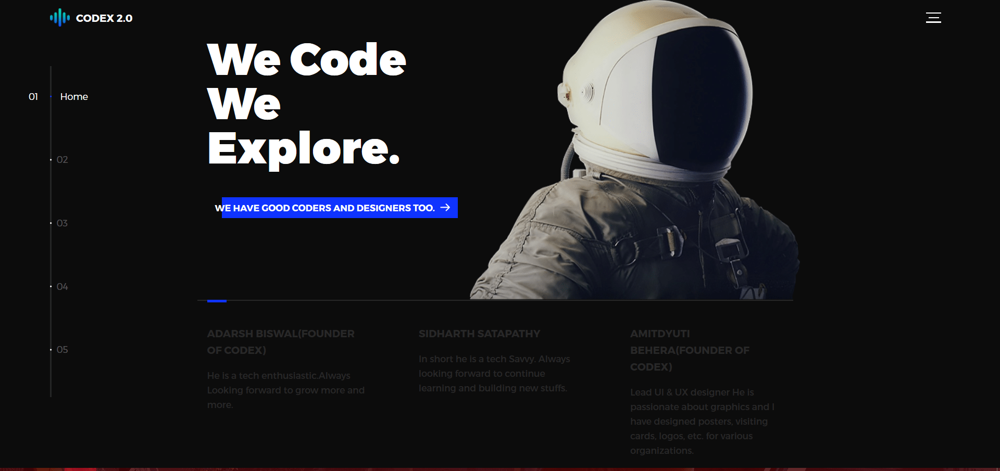

# codex-iter.github.io
Organisation Page
[Codex 2.0](http://tiny.cc/codexiter)

## *Things to add*
+ Page for coordinators of codex.
+ Finished projects and achievements.
+ Tools and utilites section.
+ Deploy the php site.